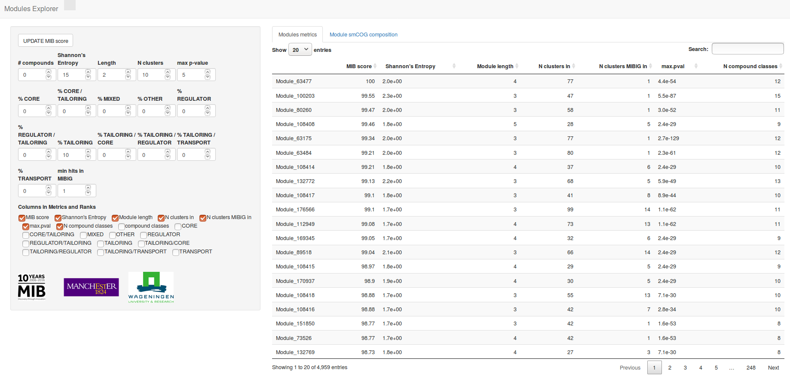

# Module Explorer

The Shiny application here described provides a very simple tool for exploring the full collection of multi-gene modules
detected with the method described in: "Computational identification of co-evolving multi-gene modules in microbial biosynthetic gene clusters".

## Getting Started

Despite beeing deployed as a web-application, the Module Explorer is meant to be run locally.
Therofore it requires the installation of some software in order to run.

### Prerequisites
Prior installation of the Module Explorer, it is necessary to download and install
[R](https://www.r-project.org/) version 3.4.4 or later. R is a programming language and
free sosoftware environment. If you are unfamiliar with the R syntax and commands, it is
reccomended to read the [introduction to R](https://cran.r-project.org/doc/manuals/R-intro.html)
document first.
<br />
<br />
The download an installation of [RStudio](https://www.rstudio.com/) is also necessary. RStudio
is a free and open-source integrated development environment for R.
<br />
<br />
The Module Explore depends on a number of other R packages, which need to be installed.
This can be simply done by copying and pasting the following into the RStudio
GUI console
```
install.packages(c("shiny", "DT", "markdown"))
```
<br />
In order to fully exploit the Module Explorer capabilities, the [Firefox](https://www.mozilla.org/) web browser should
be installed in your computer and should be set as default browser.


### Installing

From the RStudio GUI console, you can navigate to the folder where you wish
to install the Module Explorer using the following command:
```
setwd("/path/to/chosen/folder/")
```
Next, you can download the Module explorer software by copying and pasting the following:

```
download.file(url="https://github.com/francescodc87/Modules-explorer/archive/master.zip",destfile="Modules-explorer-master.zip")

```
Once downloaded, the file could be unzipped and deleted directely from the RStudio GUI console with the following commands:

```
unzip("Modules-explorer-master.zip")
file.remove("Modules-explorer-master.zip")
file.rename(from = "Modules-explorer-master/", to="Module_Explorer/")
```

Some of the files needed are to big to be hosted by GitHub.
The [Zenodo](https://about.zenodo.org/) reseach data repository is used to store these
additional data, which can be download and simply by copyng and pasting the following:


```
download.file(url="https://zenodo.org/record/1434902/files/www.zip?download=1", destfile = "Module_Explorer/www.zip")
unzip("Module_Explorer/www.zip", exdir="Module_Explorer/", unzip=getOption("unzip"), junkpaths = TRUE)
file.remove("Module_Explorer/www.zip")
```
The zip file downloaded is 3.6 GB big, hence the download and the unzipping might take several minutes.

<br />
<br />

Once the download is terminated, the Module Explorer web application can be launched
by copying and pasting the following:

```
shiny::runApp("Module_Explorer")
```

If everything works correctly, after few moments the initial page of the Module Explorer
should appear on your screen as shown.


*Figure 1: initial page of Module Explorer web application.*

### Module explorer usage


## Built With

* [antiSMASH](https://antismash.secondarymetabolites.org/)
* [R](https://www.r-project.org/)
* [RStudio](https://www.rstudio.com/)
* [Shiny](https://shiny.rstudio.com/)


## Authors

* **Francesco Del Carratore**
* **Konrad Zych**
* **Matthew Cummings**
* **Eriko Takano**
* **Marnix Medema**
* **Rainer Breitling**


