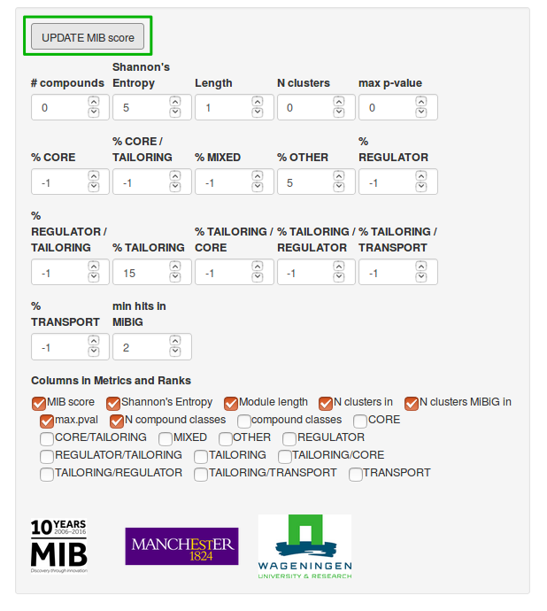
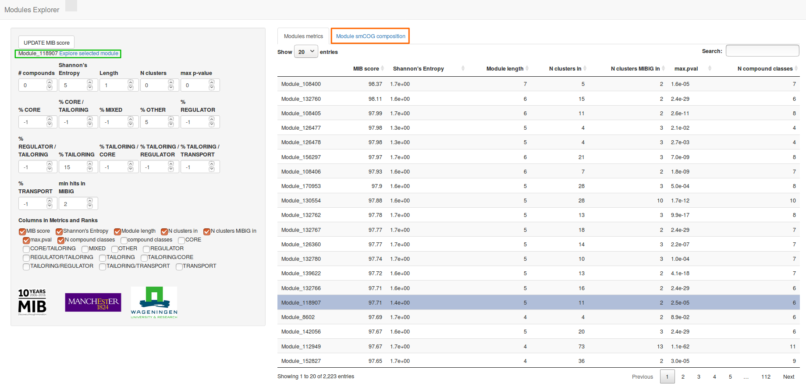
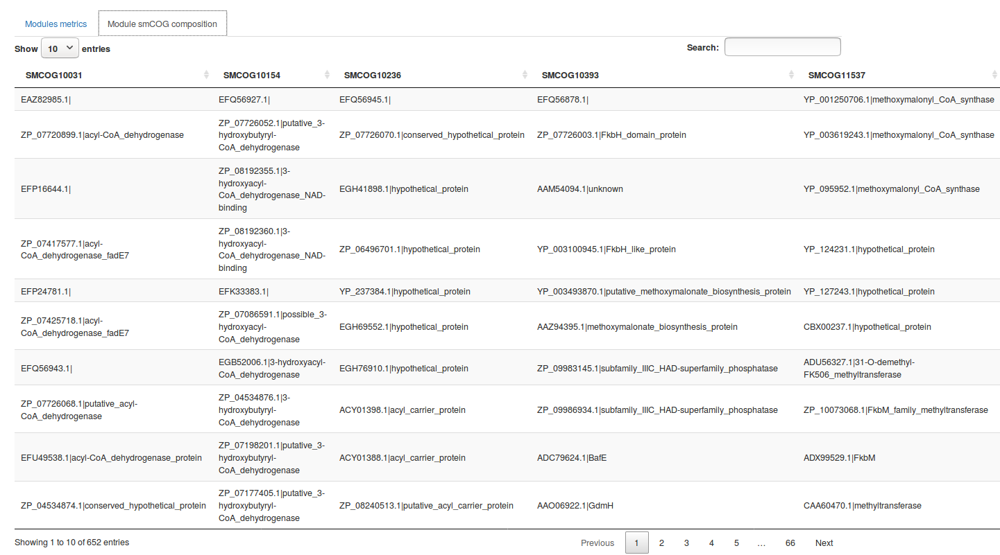
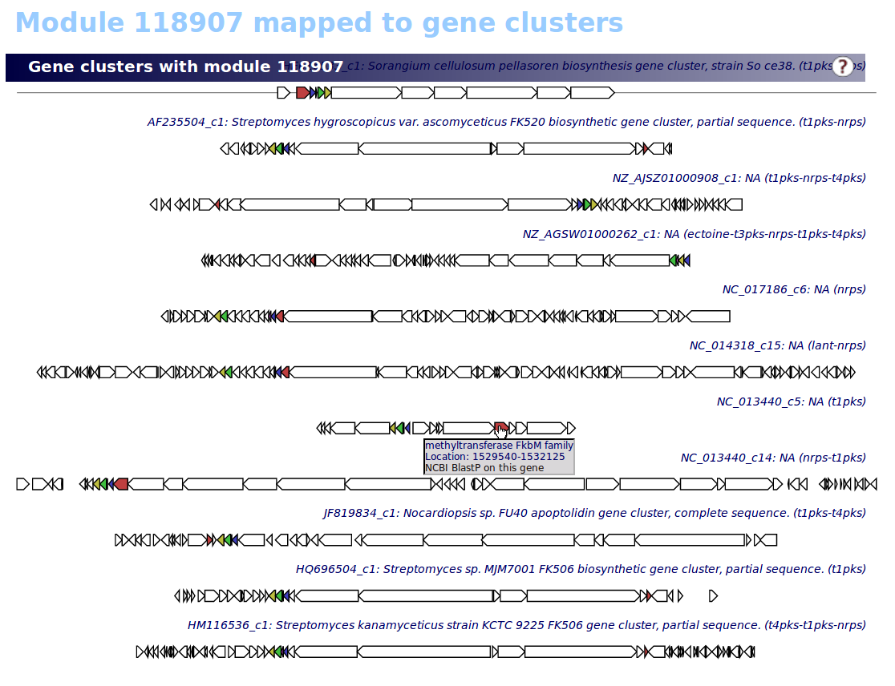

# Module Explorer

The Shiny application here described provides a very simple tool for exploring the full collection of multi-gene modules detected with the method described in: "Computational identification of co-evolving multi-gene modules in microbial biosynthetic gene clusters".

## Getting Started

Despite being deployed as a web-application, the Module Explorer is meant to be run locally. Therefore it requires the installation of some software in order to run.


### Prerequisites
Prior installation of the Module Explorer, it is necessary to download and install
[R](https://www.r-project.org/) version 3.4.4 or later. R is a programming language and
free software environment. If you are unfamiliar with the R syntax and commands, it is
recommended to read the [introduction to R](https://cran.r-project.org/doc/manuals/R-intro.html)
document first.
<br />
<br />
The download an installation of [RStudio](https://www.rstudio.com/) is also necessary. RStudio
is a free and open-source integrated development environment for R.
<br />
<br />
The Module Explore depends on a number of other R packages, which need to be installed.
This can be simply done by copying and pasting the following into the RStudio
GUI console
```
install.packages(c("shiny", "DT", "markdown"))
```
<br />
In order to fully exploit the Module Explorer capabilities [google](www.google.com/), the [Firefox](https://www.mozilla.org/) web browser should
be installed in your computer and should be set as default browser.


### Installing

From the RStudio GUI console, you can navigate to the folder where you wish
to install the Module Explorer using the following command:
```
setwd("/path/to/chosen/folder/")
```
Next, you can download the Module explorer software by copying and pasting the following:

```
download.file(url="https://github.com/francescodc87/Modules-explorer/archive/master.zip",destfile="Modules-explorer-master.zip")

```
Once downloaded, the file should be unzipped and deleted directly from the RStudio GUI console with the following commands:

```
unzip("Modules-explorer-master.zip")
file.remove("Modules-explorer-master.zip")
file.rename(from = "Modules-explorer-master/", to="Module_Explorer/")
```

Some of the files needed are too big to be hosted by GitHub.
The [Zenodo](https://about.zenodo.org/) research data repository is used to store these
additional data. The user can manually download the additional files from https://zenodo.org/record/1434902/,
extract the .zip file and move it into the Module_Explorer/ folder.
It is necessary that the www folder extracted from the .zip file is merged
with the www folder already present within the Module_Explorer folder.
Alternatively, the additional files can be simply downloaded by copying and pasting the following:
```
download.file(url="https://zenodo.org/record/1434902/files/www.zip?download=1", destfile = "Module_Explorer/www.zip")
unzip("Module_Explorer/www.zip", exdir="Module_Explorer/", unzip=getOption("unzip"), junkpaths = TRUE)
file.remove("Module_Explorer/www.zip")
```
The zip file downloaded is 3.6 GB in size; therefore the download and the unzipping will take several minutes.

<br />
<br />

Once the download is terminated, the Module Explorer web application can be launched
by copying and pasting the following:

```
shiny::runApp("Module_Explorer")
```

If everything works correctly, after few moments the initial page of the Module Explorer
should appear on your screen as shown.


*Figure 1: initial page of Module Explorer web application.*

### Module explorer usage

The table on the left side of Figure 1 contains all the detected modules ranked according to the MIB score
computed using the weights described in the manuscript.
As shown in Figure 2, it is possible to modify the weights according to the user needs.

<br />
*Figure 2: MIB score weights.*
<br />
After modifying the parameters shown in Figure 2, it is necessary to click on the UPDATE MIB score button
in order to update the shown table.

It is also possible, as shown in Figure 3, to select any module from the table by
simply clicking on the related row.


*Figure 3: Selected module.*
<br />
Once a module is selected, it is possible to click on the Module smCOG composition
tab (highlighted in orange in Figure 3).

*Figure 4: smCOG composition of selected module.*
<br />
As shown in Figure 4, this will show the smCOG composition of the selected module.
<br />
Additionally, when selecting a module, a new link will appear below the UPDATE MIB score (highlighted in green).
When clicked, this link will open a new tab showing the selected module mapped on all the biosynthetic
gene clusters containing it, similarly to what is shown in Figure 5.

*Figure 5: selected module mapped on Biosynthetic gene clusters.*
<br />
It is possible to click on any gene shown in this page, this will open a pop-up window showing
the gene annotation, its location and providing a link to the NCBI Blast result for this gene.

## Built With

* [antiSMASH](https://antismash.secondarymetabolites.org/)
* [R](https://www.r-project.org/)
* [RStudio](https://www.rstudio.com/)
* [Shiny](https://shiny.rstudio.com/)


## Authors

* **Francesco Del Carratore**
* **Konrad Zych**
* **Matthew Cummings**
* **Eriko Takano**
* **Marnix Medema**
* **Rainer Breitling**


